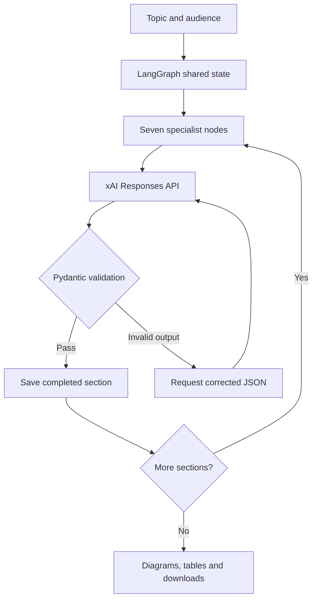

# Seven-Step Topic Tutor — Grok API edition

The same seven-agent Python + LangGraph educational application, now using **xAI Grok** through the current **Responses API**. No local model server or model download is needed.

## Quick start: one command

1. Extract the ZIP and open Terminal in the extracted `topic_tutor_grok` folder.
2. Run:

```bash
python3 run.py
```

3. Open **http://localhost:8501**, enter your **xAI API key** in the sidebar password field, enter a topic, and click **Explain in seven steps**.

Prerequisites: Python 3.11–3.13 (3.12 recommended), internet access, and an xAI API key with model access and sufficient credits. Get a key at https://console.x.ai/. This is Grok from xAI; keys from Groq are not interchangeable.

The launcher creates a private `.venv`, installs the pinned direct dependencies, and starts Streamlit. Subsequent launches reuse that environment. It does not make generation requests until you submit a topic. The ZIP contains executable Python source, not a self-contained native binary or Python interpreter.

Windows: use `py -3 run.py` or double-click `start.bat`. macOS: `python3 run.py` or `bash start.command`.

## Set the key once instead of entering it each session

Copy `.env.example` to `.env` in the project folder and edit:

```dotenv
XAI_API_KEY=your_xai_api_key_here
XAI_MODEL=grok-4.7
```

Replace only the placeholder with your real key. You can also set `XAI_API_KEY` in your operating system environment. Environment values take precedence over `.env`; a nonempty sidebar key overrides both for the current session. The loader accepts literal KEY=value lines with optional matching quotes; it does not execute shell expressions or interpolate variables.

The key is not included in lesson downloads. Environment keys are not populated into the browser password field. Sidebar keys remain in the Streamlit session while in use. Keep `.env` private; it is excluded from Git and the Docker build context.

The default model is `grok-4.7`, listed in xAI's current documentation when this package was built. **Check key and available models** retrieves model IDs from your account. If necessary, enter an exact accessible text model ID that supports Responses and structured outputs; the application never silently substitutes a different model. Model access can vary by account.

## Your seven requested outputs

| Step | Specialist | Output |
|---|---|---|
| 1 | Architect | Components, responsibilities, architecture steps and a rendered flow diagram |
| 2 | Professional educator | Precise explanation, core concepts, tradeoffs and common pitfalls |
| 3 | Plain-language teacher | Everyday analogy, concept mapping and analogy limitations |
| 4 | Comparison analyst | A table comparing at least three related topics |
| 5 | Example designer | At least three worked examples, each with steps and expected results |
| 6 | End-to-end guide | Prerequisites, major workflow, failure handling, verification and another diagram |
| 7 | Summarizer | Exactly two sentences synthesizing the preceding sections |

Language options: English, Telugu and Hindi. Audience options: Beginner, Software engineer, and Senior engineer / Tech Lead. Generated language and factual quality depend on the selected model.

Useful topics to try:
- JWT authentication and refresh tokens in Spring Boot 3
- Kafka consumer groups, partitions, rebalancing and duplicate processing
- LangGraph versus LangChain versus CrewAI
- Angular switchMap, mergeMap, concatMap and exhaustMap
- A real-time ingestion pipeline that validates, masks and publishes data

Use a focused topic for depth. An arbitrarily broad subject cannot be fully covered in one lesson.

## Architecture



Agent order: Architect → Professional educator → Plain-language teacher → Comparison analyst → Example designer → End-to-end guide → Summarizer.

Each node uses the same selected Grok model with its own role prompt and output schema. LangGraph coordinates the state and order. These are role-specialized agents in a fixed workflow, not autonomous web researchers. No web search or code-execution tools are enabled.

The request is sent via HTTPX to `https://api.x.ai/v1/responses`, with `input`, a JSON schema in `text.format`, and `store=false`. The client reads only final `output_text` message blocks; reasoning blocks are ignored. Credentials are sent in the Authorization header. The endpoint is fixed, preventing accidental submission of the key to a mistyped custom server URL.

Architecture context is shared with later agents. The summarizer sees bounded excerpts of all six sections to limit input size; very long details may be omitted from those excerpts. Pydantic verifies the number of examples, valid diagram references and a two-sentence summary. Validation confirms structure, not factual truth.

Diagrams are built from validated node/edge data with quoted labels and rendered by Streamlit Graphviz. No system Graphviz installation or external diagram CDN is required. Downloadable Markdown includes diagram DOT source; JSON contains the complete lesson data; PDF exports a printable summary of each section for sharing.

## API usage, retries and recovery

- A normal lesson makes **seven generation requests**, plus a model-list request to check access.
- At most three attempts per section: automatic retries cover malformed structured output, HTTP 429, and HTTP 5xx. A single complete run therefore makes at most 21 generation attempts. Manual retries can add more.
- Authentication, permission, billing and invalid-request errors stop immediately.
- Timeouts and network failures stop for an explicit user retry because the request may already have been processed or billed.
- Incomplete output stops with guidance to increase the output budget or narrow the topic. Refusals are not automatically retried.
- The UI shows tokens reported by the API, including received responses that failed local validation. Responses without returned usage are not counted. This is not a billing reconciliation or a currency estimate.
- Timeout defaults to 180 seconds per request. The default output budget is 8,000 tokens; model reasoning can consume part of that budget. Adjust both in the sidebar.
- Completed sections survive a generation failure within the current browser session. Click **Retry remaining sections** to skip already completed nodes. Retry uses the current key, timeout and token budget; submit a new lesson to change model, language or topic.
- Download a lesson to retain it across browser refreshes or server restarts. No persistent database is included.

API calls incur charges according to your account and current xAI pricing. Check https://docs.x.ai/developers/pricing. This application does not assume API usage is free or covered by a consumer subscription.

## Docker: one-command deployment

With Docker installed, run:

```bash
docker compose up --build -d
```

Open **http://localhost:8501** and enter your key, or put `XAI_API_KEY` in `.env` before running compose. Compose injects credentials at runtime; the Docker image does not contain `.env`. Stop with `docker compose down`.

The container needs outbound HTTPS access to `api.x.ai`. The service is bound to localhost by default and runs as a non-root user. The provided configuration is a deployment package, not an already hosted public site. For a shared deployment, use authenticated access, TLS, runtime secrets and usage controls; the app does not implement multi-user authentication or per-user billing limits. When a server-wide API key is configured, anyone allowed to use that instance can generate billable requests with it.

## Troubleshooting

| Message or symptom | What to do |
|---|---|
| Missing key | Enter your xAI key in the sidebar or configure `.env` |
| HTTP 401 | Replace an invalid or revoked key; confirm it is an xAI key |
| HTTP 402 or 403 | Check API credits, key permissions and model access in the xAI console |
| Model unavailable / HTTP 404 | Check accessible models and copy an exact supported model ID |
| HTTP 400 / 422 | Check model support for Responses and structured output |
| HTTP 429 | Wait; check your account rate limits and quota |
| Timeout | Increase timeout; an explicit retry may result in another billable request |
| Incomplete output | Increase output token budget or narrow the topic, then retry remaining sections |
| Port already used | Run `python3 run.py --port 8502` |
| Installation fails | Use Python 3.12 and check access to the Python package index |

Optional credential check, using environment or `.env` credentials:

```bash
python3 run.py --check
```

This checks model-list access without generating a lesson. Use `python3 run.py --model EXACT_MODEL_ID` to override the model at startup.

## Files and customization

| File | Purpose |
|---|---|
| `app.py` | UI, credentials input, progress, recovery and downloads |
| `run.py` | Single-command environment setup and launcher |
| `tutor/grok_client.py` | Grok Responses requests, structured JSON, usage and errors |
| `tutor/config.py` | Literal `.env` loading |
| `tutor/models.py` | Seven agent instructions and Pydantic contracts |
| `tutor/workflow.py` | LangGraph nodes, shared state and agent order |
| `tutor/render.py` | Markdown and diagram rendering |
| `tests/` | Workflow, xAI transport and Streamlit tests |
| `requirements.txt` | Pinned direct runtime dependencies |
| `requirements-lock-tested.txt` | Exact Python 3.12/Linux environment used in tests |
| `Dockerfile`, `compose.yaml` | Container deployment |

Change specialist prompts in `SPECS` in `tutor/models.py`. If adding output fields, update both the schema and renderer. The app uses documented `StateGraph`, `compile`, `stream`, Pydantic v2 and Responses REST interfaces; no legacy agent helpers or beta SDK parsing methods are used.

## Run the tests

After the first launch creates `.venv`:

```bash
.venv/bin/python -m pip install -r requirements-dev.txt
.venv/bin/python -m pytest -q -W error::DeprecationWarning
```

On Windows use `.venv\Scripts\python.exe`. Tests use mock API responses; see `TEST_REPORT.md` for actual results and limits. Generated facts and example code still require review. No live source verification or generated-code execution is performed.

Official references checked for this version:
- https://docs.x.ai/developers/rest-api-reference/inference/responses
- https://docs.x.ai/developers/model-capabilities/text/structured-outputs
- https://docs.x.ai/developers/models
- https://docs.langchain.com/oss/python/langgraph/graph-api
